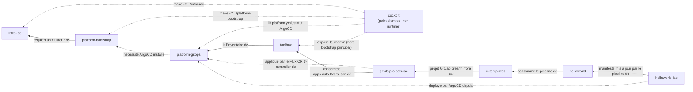

# Carte des repos

Ce workspace est volontairement decoupe en plusieurs repos pour montrer les
frontieres d'une plateforme CI/CD GitOps. Pour apprendre le systeme, lire les
repos dans cet ordre.

| Repo | Role | A retenir |
|---|---|---|
| `cockpit` | Point d'entree operateur | Orchestre les autres repos sans devenir une dependance runtime. |
| `infra-iac` | Socle Kubernetes local | Cree les VMs, initialise Kubernetes et installe les add-ons reseau bas niveau. |
| `platform-bootstrap` | Bootstrap technique | Installe ArgoCD, configure le bootstrap initial et expose les commandes operateur. |
| `platform-gitops` | Etat GitOps suivi par ArgoCD | Contient `argocd/managed/`, `argocd/platform/` et l'inventaire applicatif. |
| `toolbox` | Outillage partage | Onboarding d'apps (PR sur l'inventaire), rendu des variables Terraform GitLab. |
| `gitlab-projects-iac` | Provisioning GitLab | Terraform (applique automatiquement par Flux) : cree/met a jour les projets GitLab, la protection de branches et les miroirs GitHub. |
| `ci-templates` | Pipeline applicatif generique | Template GitLab CI versionne, inclus par les apps. |
| `helloworld` | App exemple | Monorepo applicatif multi-services. |
| `helloworld-iac` | Manifests app exemple | Manifests Kubernetes promus par branches d'environnement. |

## Flux principal

1. `infra-iac` fournit le cluster Kubernetes local.
2. `platform-bootstrap` installe ArgoCD et applique le root Application.
3. ArgoCD lit `platform-gitops` et synchronise GitLab, les routes plateforme
   et les ApplicationSets applicatifs (les images applicatives sont poussées
   sur GHCR, pas sur un registry interne au cluster).
4. `toolbox` lit l'inventaire de `platform-gitops` et genere
   `apps.auto.tfvars.json` pour `gitlab-projects-iac` (les credentials ArgoCD
   des repos manifests sont fabriques en continu par External Secrets
   Operator).
5. Le Terraform de `gitlab-projects-iac` (applique automatiquement par Flux)
   cree ou met a jour les projets GitLab, la protection de branches et les
   miroirs GitHub.
6. `ci-templates` definit la chaine CI/CD consommee par `helloworld`.
7. `helloworld` pousse des images et modifie `helloworld-iac`.
8. ArgoCD deploie `helloworld-iac` dans les namespaces d'environnement.

## Diagramme de dependances

Convention : `A --> B` signifie "A depend de B" (A a besoin de B pour
fonctionner), comme un graphe de dependances npm/Maven — pas l'ordre
chronologique d'execution (voir le flux principal ci-dessus pour l'ordre).
Les fleches en pointilles marquent des dependances de deploiement/runtime
(ArgoCD, orchestration cockpit), les fleches pleines des dependances de
contenu (donnees, code, pipeline).

